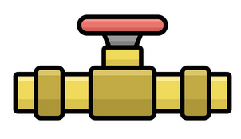

<a id="readme-top"></a>
<!--
*** With gratitude, from https://github.com/othneildrew/Best-README-Template/ 
*** Thanks for checking out the Best-README-Template. If you have a suggestion
*** that would make this better, please fork the repo and create a pull request
*** or simply open an issue with the tag "enhancement".
*** Don't forget to give the project a star!
*** Thanks again! Now go create something AMAZING! :D
-->


<!-- PROJECT LOGO -->
<br />
<div align="center">
  <a href="https://github.com/swoodums/mint-pipe">
    
  </a>

<h3 align="center">Project mint-pipe</h3>

  <p align="center">
    An end-to-end data pipeline learning project, using Earth-orbiting objects data.
    <br />
  </p>
</div>


<!-- TABLE OF CONTENTS -->
<details>
  <summary>Table of Contents</summary>
  <ol>
    <li>
      <a href="#about-the-project">About The Project</a>
      <ul>
        <li><a href="#built-with">Built With</a></li>
      </ul>
    </li>
    <li>
      <a href="#getting-started">Getting Started</a>
      <ul>
        <li><a href="#prerequisites">Prerequisites</a></li>
        <li><a href="#installation">Installation</a></li>
      </ul>
    </li>
    <li><a href="#usage">Usage</a></li>
    <li><a href="#roadmap">Roadmap</a></li>
    <li><a href="#license">License</a></li>
    <li><a href="#contact">Contact</a></li>
    <li><a href="#acknowledgments">Acknowledgments</a></li>
  </ol>
</details>


<!-- ABOUT THE PROJECT -->
## About The Project

<!-- ![Product Name Screen Shot][product-screenshot] -->

The end objective is to have a whole data pipeline built out to learn a slew of data engineering skills.

I will be using FastAPI to build some endpoints that consume data, transform it, and output it to a JSON.

The data is coming from a public API found on https://api.nasa.gov/.  The actual API is https://tle.ivan.stanojevic.me/api/.  It is data for earth-orbiting objects at a given point in time.  It provides two-line element set records, updated daily from  CelesTrak and served as a JSON.  A two-line element is a data format encoding a lsit of orbital elements of an earth-orbiting object for a given point in time.

We will be extracting the data for each element and flattening the data, so we have one row per object, with the data types defined.  This ensures we have a predicatable schema, and the API will perform data validation.

<p align="right">(<a href="#readme-top">back to top</a>)</p>


### Built With

* Python 3.12.3
* FastAPI

<p align="right">(<a href="#readme-top">back to top</a>)</p>


<!-- GETTING STARTED -->
## Getting Started

This is an example of how you may give instructions on setting up your project locally.
To get a local copy up and running follow these simple example steps.  Lorem ipsum since we're still in development.

### Prerequisites

This is an example of how to list things you need to use the software and how to install them.  Lorem ipsum since we're still in development.

### Installation

All lorem ipsum since we're still in development

1. Get a free API Key at [https://example.com](https://example.com)
2. Clone the repo
   ```sh
   git clone https://github.com/swoodums/mint-pipe.git
   ```
3. Install required packages
4. Run uvicorn server
5. Change git remote url to avoid accidental pushes to base project
   ```sh
   git remote set-url origin swoodums/mint-pipe
   git remote -v # confirm the changes
   ```

<p align="right">(<a href="#readme-top">back to top</a>)</p>


<!-- USAGE EXAMPLES -->
## Usage

Use this space to show useful examples of how a project can be used. Additional screenshots, code examples and demos work well in this space. You may also link to more resources.

_For more examples, please refer to the [Documentation](https://example.com)_

<p align="right">(<a href="#readme-top">back to top</a>)</p>


<!-- ROADMAP -->
## Roadmap

- [ ] Develop API around existing endpoint
    - [x] Build logic for parsing TLE to a flattened JSON
    - [ ] Build out calling to existing API
    - [ ] Build out new API endpoint with transformed data
- [ ] Build out FastAPI server. 
    - Being able to create an API interface between some data source producer and some consumer is a skill to learn for data engineering.  While we could simply unwind and load the JSON, we could also build an API that processes the two-line element data into a JSON format, and does some validation.  This should allow us to load the data more easily using Airbyte, as well.
- [x] Orchestrate CI in GitHub Actions
- [ ] Orchestrate CD in GitHub Actions'
    - Need to have something to deploy, and set up deployment.
- [ ] Deploy Airbyte into a Linux environment
    - May require setting up kubernetes or dummying it locally.  This feels like it might be wildly out of scope... more to come.
- [ ] Build an Airbyte REST API connector to connect to your FastAPI streams.
- [ ] Figure out how Minio works and use it as an S3 destination.
- [ ] Set up your source/destination/connection not through UI but through airbytes cli. 
- [ ] Figure out Dagster, connect Airbyte to Dagster. Set up a schedule to sync your data. Preferably you've made them all incremental.
- [ ] Install duckdb on your Linux box (or postgres or whatever simple open-source database works in linux)
- [ ] Get a dbt model up and running and build a data model. 
- [ ] Orchestrate everything in Dagster. 
- [ ] Connect to your duckdb data model from some other client using dbeaver.

<!-- See the [open issues](https://github.com/swoodums/mint-pipe/issues) for a full list of proposed features (and known issues).
Save this for when you actually have features built out in GitHub, if you do. -->

<p align="right">(<a href="#readme-top">back to top</a>)</p>


<!-- LICENSE -->
## License

Distributed under the MIT License. See `LICENSE` for more information.

<p align="right">(<a href="#readme-top">back to top</a>)</p>


<!-- CONTACT -->
## Contact

Sam Woodbeck - [LinkedIn](https://www.linkedin.com/in/samuel-woodbeck-25224230) -  samuel.woodbeck@gmail.com

Project Link: [https://github.com/swoodums/mint-pipe](https://github.com/swoodums/mint-pipe)

<p align="right">(<a href="#readme-top">back to top</a>)</p>


<!-- ACKNOWLEDGMENTS -->
## Acknowledgments

* [Othneil Drew for his great README template](https://github.com/othneildrew)

<p align="right">(<a href="#readme-top">back to top</a>)</p>


<!-- MARKDOWN LINKS & IMAGES -->
<!-- https://www.markdownguide.org/basic-syntax/#reference-style-links -->
[product-screenshot]: images/screenshot.png